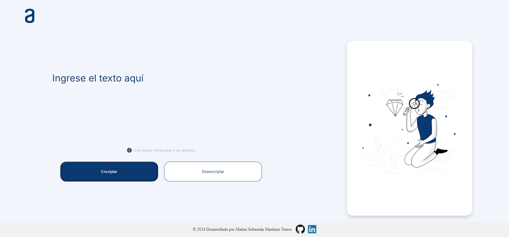
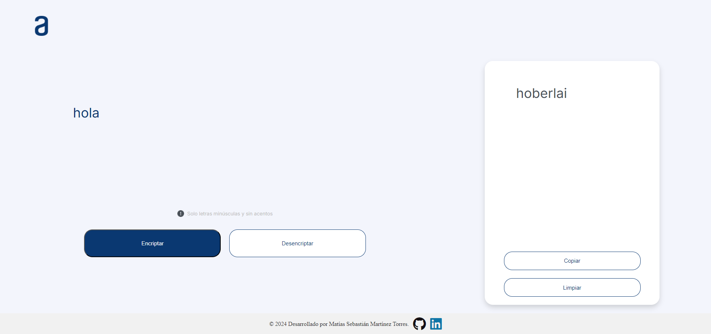
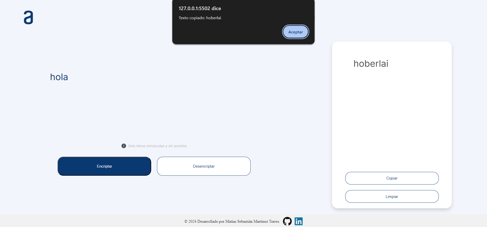
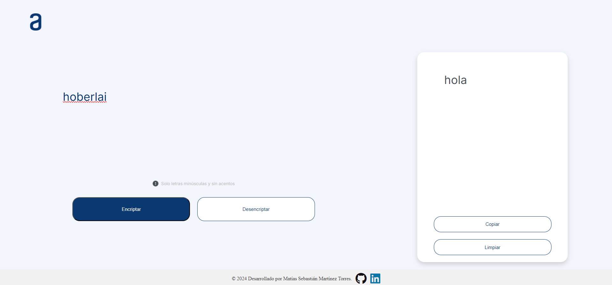

# Encriptador

## **Encriptador y Desencriptador de Texto**
Esta aplicación web permite encriptar y desencriptar texto utilizando una serie de reglas sencillas. Los textos ingresados deben estar en minúsculas y sin acentos. La aplicación está diseñada para ofrecer una experiencia de usuario fluida en dispositivos de escritorio, tabletas y teléfonos móviles.

## **Funcionalidades**
Encriptar texto: Ingresar un texto en minúsculas y sin acentos, y encriptarlo al pulsar el botón "Encriptar".
## Galería de Imágenes de funcionamiento

## Capturas de Pantalla

### Imagen 1

### Imagen 2

### Imagen 3

### Imagen 4

Copiar texto encriptado: Copia el resultado encriptado al portapapeles con un solo clic en el botón "Copiar", y recibe una alerta de confirmación.
Desencriptar texto: Pega un texto encriptado y desencríptalo pulsando el botón "Desencriptar".
Limpiar campos: Borra todo el contenido ingresado y encriptado para comenzar nuevamente con un solo clic en el botón "Limpiar".

## **Requisitos**
Navegador web moderno y actualizado (Chrome, Firefox, Safari, etc.).
Conexión a internet para acceder a la aplicación.
Tecnologías Utilizadas
HTML5: Estructura de la página web.
CSS3: Estilos y diseño adaptable para diferentes dispositivos (Responsive Design).
JavaScript: Lógica para encriptar, desencriptar, copiar y limpiar el texto.
Instalación y Uso

## **Clonar el repositorio:**
bash
Copiar código
git clone https://github.com/Sebadev-7/encriptador.git

## **Abrir el proyecto:**

Navega a la carpeta del proyecto y abre el archivo index.html en tu navegador preferido.
Uso de la aplicación:

Encriptar: Escribe un texto en el área designada y pulsa "Encriptar".
Copiar: Haz clic en "Copiar" para guardar el texto encriptado en el portapapeles.
Desencriptar: Pega el texto encriptado y pulsa "Desencriptar".
Limpiar: Borra todo el contenido con un clic en "Limpiar".
Adaptabilidad
## **La aplicación ha sido adaptada para ser visualmente atractiva y funcional en diferentes dispositivos, incluyendo:**

Escritorios
Tabletas
Teléfonos móviles

## Autor
Esta aplicación fue desarrollada por Matías Sebastián Martínez Torres, estudiante de programación en Alura Latam. Actualmente, se encuentra estudiando desarrollo frontend.
